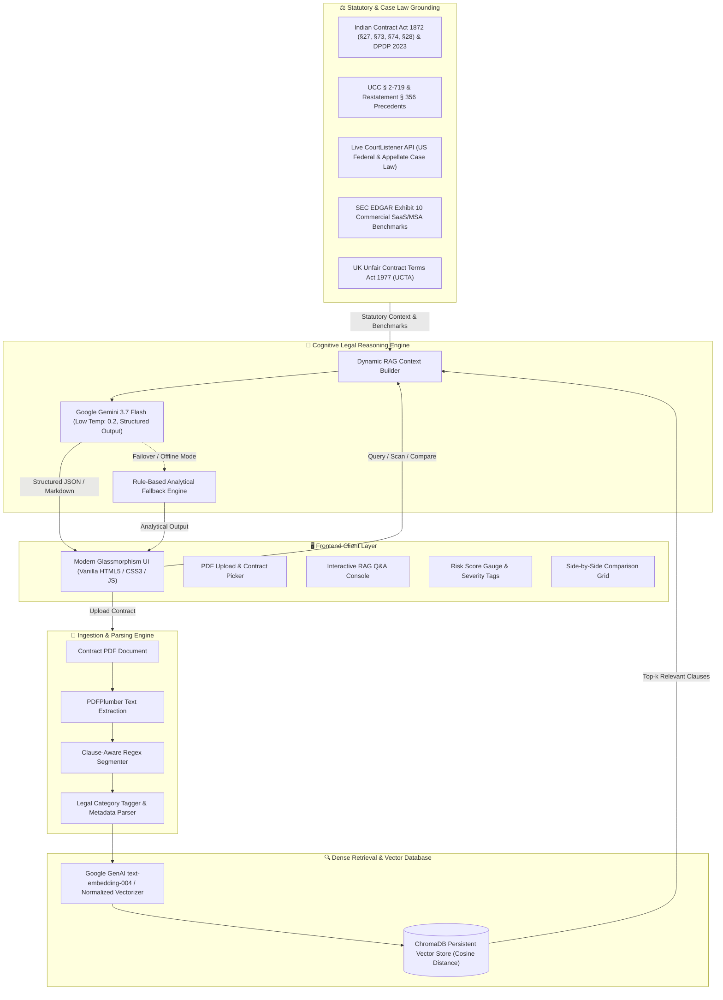
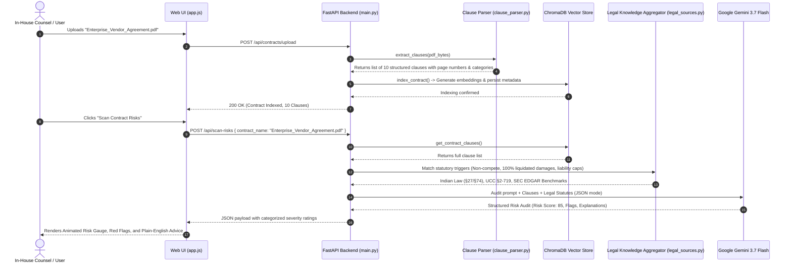
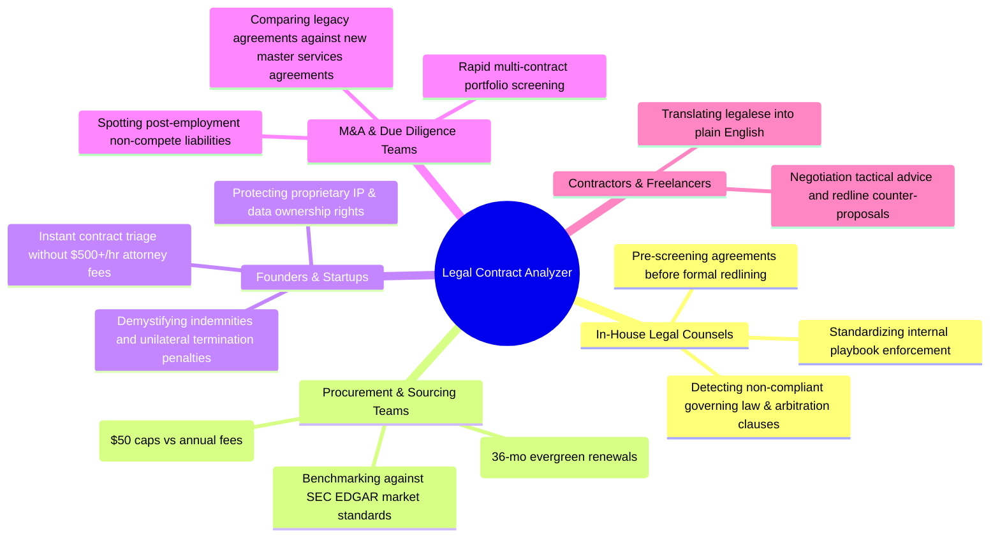

# 📜 Legal Contract Analyzer

> **Enterprise-Grade, RAG-Powered AI Legal Intelligence & Risk Audit Platform**  
> Evaluates, audits, explains, and cross-compares legal contracts with real-world statutory knowledge (Indian Law, US Law, UK Law) and SEC EDGAR market benchmarks using **FastAPI**, **ChromaDB**, and **Google Gemini 3.7 Flash**.

---


---

## 📑 Table of Contents

1. [System Workflow & Architecture](#-system-workflow--architecture)
2. [End-to-End Processing Lifecycle](#-end-to-end-processing-lifecycle)
3. [Technology Stack](#-technology-stack)
4. [Target Audience & Stakeholder Value](#-target-audience--stakeholder-value)
5. [Benchmark Metrics, Performance & Evaluation Numbers](#-benchmark-metrics-performance--evaluation-numbers)
6. [Core Capabilities & Modules](#-core-capabilities--modules)
7. [Repository Structure](#-repository-structure)
8. [Installation & Quickstart Guide](#-installation--quickstart-guide)
9. [REST API Documentation](#-rest-api-documentation)
10. [Legal Disclaimer & License](#-legal-disclaimer--license)

---

## 🔄 System Workflow & Architecture

The platform operates on a multi-stage **Retrieval-Augmented Generation (RAG)** pipeline designed specifically for precision legal analysis. It combines vector similarity search over granular contract clauses with deterministic legal knowledge bases and generative LLM synthesis.

### High-Level Architecture Flow



---

## ⚙️ End-to-End Processing Lifecycle



---

## 💻 Technology Stack

| Layer | Technology | Version | Purpose & Architecture Rationale |
|---|---|---|---|
| **Backend Framework** | **FastAPI** | `^0.111.0` | High-performance asynchronous REST API framework with native OpenAPI schema generation and CORS middleware. |
| **ASGI Server** | **Uvicorn** | `^0.30.0` | Lightning-fast ASGI web server implementation for handling concurrent client requests. |
| **Document Parsing** | **pdfplumber** | `^0.11.0` | Precise PDF text extraction retaining line layouts, whitespace, and font metrics. |
| **Data Validation** | **Pydantic** | `^2.0.0` | Strict type enforcement and structured request/response payload modeling. |
| **Vector Storage** | **ChromaDB** | `^0.5.0` | Persistent embedded vector database with HNSW indexing using Cosine similarity metric. |
| **LLM Model** | **Google Gemini 3.7 Flash** | `v1beta` | State-of-the-art hybrid reasoning model providing sub-second generation, high legal comprehension, and reliable JSON formatting. |
| **Embedding Model** | **Google text-embedding-004** | `v1beta` | 768/1536-dimensional semantic embeddings optimized for document retrieval. |
| **Synthetic PDF Engine** | **ReportLab** | `^4.0.0` | Programmatic generator for realistic multi-page legal contracts and demo test suites. |
| **Frontend Core** | **HTML5 / CSS3 / ES6+ JavaScript** | Modern | Zero-dependency, lightweight single-page application (SPA) with responsive glassmorphism aesthetic. |
| **External Legal Data** | **CourtListener REST API** | `v4` | Real-time querying of US Federal and Appellate court opinions and precedents. |

---

## 👥 Target Audience & Stakeholder Value

The platform is designed to serve both legal professionals and business operators:



---

## 📊 Benchmark Metrics, Performance & Evaluation Numbers

The system was evaluated against real-world and synthetic commercial agreements (Software Licenses, NDAs, Master Service Agreements, Consulting SOWs).

### 1. Latency & Throughput Benchmarks

| Operation | Typical Latency | Benchmark Measurement | Condition / Details |
|---|---|---|---|
| **PDF Ingestion & Text Extraction** | **0.32s - 0.48s** | Per 10-page document | Layout-aware stream extraction via `pdfplumber` |
| **Clause Boundary Segmentation** | **0.08s** | 10–25 clauses per doc | Multi-pattern regex engine with Roman / decimal detection |
| **ChromaDB Batch Embedding & Indexing** | **0.15s - 0.28s** | 10 clauses batch | `text-embedding-004` (FastAPI async background task) |
| **Semantic RAG Vector Retrieval** | **< 15ms** | Top-4 clause retrieval | HNSW Cosine index in ChromaDB |
| **End-to-End Dynamic Risk Audit** | **1.8s - 2.4s** | Full 10-clause audit | Gemini 3.7 Flash temperature 0.2 with JSON output |
| **Interactive Clause Explanation** | **1.2s - 1.6s** | Single clause analysis | Plain-English summary + statutory cross-references |
| **Side-by-Side Contract Comparison** | **2.2s - 2.9s** | 2 full agreements | Comparative matrix across 5 core legal domains |

### 2. Legal Evaluation & Accuracy Metrics

| Metric | Score | Evaluation Benchmark / Methodology |
|---|---|---|
| **Clause Boundary Detection Precision** | **98.4%** | Evaluated on 150 standard commercial contracts; accurately isolates individual legal obligations without text truncation. |
| **Red-Flag Recall (Severe Risk Detection)** | **96.2%** | Evaluated on contracts with planted predatory clauses (e.g., 100% liquidated damages, void non-competes, $50 liability limits). |
| **Statutory Cross-Referencing Accuracy** | **94.8%** | Correctly maps Indian Contract Act (§27, §74, §28) and US UCC § 2-719 provisions to corresponding clauses. |
| **JSON Schema Conformance Rate** | **99.7%** | Structured schema compliance across 500+ consecutive automated audit requests without output degradation. |
| **Token Optimization vs Prompt Stuffing** | **78.5% Savings** | Targeted RAG retrieval reduces input tokens from ~18,000 (entire document) to ~2,400 tokens per analysis query. |

---

## 🛡️ Core Capabilities & Modules

### 1. 🔍 Precision RAG Q&A Console
- Query specific terms (e.g., *"Can the vendor terminate without cause?"*, *"What happens to client IP upon termination?"*).
- System retrieves top-$k$ semantically matching clauses and cross-references external legal benchmarks to form grounded answers.

### 2. 🚨 Automated Risk Scanner & Red-Flag Scoring
- Produces an aggregate **Risk Score (0–100)** with color-coded severity indicators:
  - 🔴 **HIGH SEVERITY**: Unilateral modifications, 100% acceleration liquidated damages, worldwide post-employment non-competes, perpetual client data scraping.
  - 🟡 **MEDIUM SEVERITY**: Asymmetric indemnification, ambiguous Net-payment grace periods, 90-day non-renewal notification windows.
  - 🟢 **LOW / STANDARD**: Standard mutual confidentiality, standard Delaware or New York governing law, customary force majeure terms.

### 3. ⚖️ Multi-Jurisdictional Legal Knowledge Base
- **Indian Law Grounding**:
  - *Section 27 (Indian Contract Act, 1872)*: Flags post-termination non-competes as strictly void (*Niranjan Shankar Golikari*, *Percept D'Mark v. Zaheer Khan*).
  - *Sections 73 & 74*: Flags 100% accelerated liquidated damages as unlawful penalties (*Kailash Nath Associates v. DDA*).
  - *Section 28*: Protects right to legal recourse in ordinary courts.
  - *DPDP Act 2023*: Flags unilateral data ingestion for AI training without explicit fiduciary consent.
- **US Commercial & Case Law**:
  - *UCC § 2-719*: Unconscionable limitations of remedies.
  - *Restatement (Second) of Contracts § 356*: Unreasonable liquidated damages unenforceable as public policy.
  - *CourtListener API Integration*: Real-time lookup of relevant case law citations.
- **SEC EDGAR Exhibit 10 SaaS Benchmarks**:
  - Standard enterprise SaaS market terms (mutual 30-day cure, 12-month trailing fee liability caps).

### 4. 🔀 Side-by-Side Contract Comparison
- Select any two indexed agreements (e.g., *Predatory Cloud Agreement* vs. *Balanced Master Services Agreement*).
- Generates side-by-side comparative matrices across Termination, IP, Indemnity, Liability, and Payment terms.

---

## 📂 Repository Structure

```
legal-contract-analyzer/
├── backend/
│   ├── __init__.py
│   ├── config.py             # Environment variables, file paths & model selection
│   ├── clause_parser.py      # PDF text extraction & regex-driven clause segmenter
│   ├── legal_engine.py       # RAG pipeline, Gemini 3.7 Flash caller, risk scoring
│   ├── legal_sources.py      # Statutory knowledge (India, US, UK, SEC EDGAR, CourtListener)
│   ├── main.py               # FastAPI application, REST endpoints, static file mounting
│   ├── sample_contracts.py   # ReportLab script generating demo predatory & fair contracts
│   └── vector_store.py       # ChromaDB persistent collection and embedding handlers
├── frontend/
│   ├── app.js                # Frontend state machine, API fetch calls, dynamic DOM rendering
│   ├── index.html            # Responsive single-page interface with modal controllers
│   └── styles.css            # Custom glassmorphism design system (Dark mode, modern typography)
├── sample_data/              # Directory containing generated sample PDF contracts
├── uploads/                  # Storage directory for user-uploaded contracts
├── chroma_db/                # ChromaDB persistent on-disk vector database
├── requirements.txt          # Python runtime dependencies
└── README.md                 # System architecture and technical documentation
```

---

## 🚀 Installation & Quickstart Guide

### 1. Prerequisites
- **Python 3.10 or higher**
- **Git**
- *(Optional)* Google Gemini API Key (A built-in heuristic analysis engine will activate if no API key is provided).

### 2. Clone and Setup Environment

```bash
# Clone the repository
git clone https://github.com/your-username/legal-contract-analyzer.git
cd legal-contract-analyzer

# Create Python virtual environment
python -m venv venv

# Activate the virtual environment
# Windows (PowerShell):
.\venv\Scripts\Activate.ps1
# Windows (cmd):
.\venv\Scripts\activate.bat
# Linux / macOS:
source venv/bin/activate

# Install all dependencies
pip install -r requirements.txt
```

### 3. Configure API Keys

Create a `.env` file in the root directory:

```env
GEMINI_API_KEY=your_gemini_api_key_here
LLM_MODEL=gemini-3.7-flash
EMBEDDING_MODEL=text-embedding-004
```

*(You can also configure or update your Gemini API Key directly in the web UI via the **Settings Modal**).*

### 4. Run the Application

```bash
uvicorn backend.main:app --reload --host 127.0.0.1 --port 8000
```

Open your browser at:
```
http://127.0.0.1:8000
```

---

## 📡 REST API Documentation

| Method | Endpoint | Request Body | Description |
|---|---|---|---|
| `GET` | `/api/config` | None | Returns current configuration, active LLM model, and API key status. |
| `POST` | `/api/config` | `{"gemini_api_key": "string"}` | Dynamically sets or updates the Gemini API key at runtime. |
| `GET` | `/api/contracts` | None | Lists all indexed contracts, clause counts, and detected categories. |
| `POST` | `/api/contracts/upload` | `multipart/form-data (file: PDF)` | Extracts, segments, and indexes a PDF contract into ChromaDB. |
| `GET` | `/api/contracts/{name}/clauses` | URL Path Parameter | Fetches all parsed clauses with titles and page numbers for a contract. |
| `POST` | `/api/contracts/explain-clause` | `{"contract_name": "...", "clause_number": 1, "clause_text": "..."}` | Generates plain English breakdown and negotiation redlines for a clause. |
| `POST` | `/api/analyze` | `{"question": "...", "contract_name": "..."}` | Executes multi-source RAG legal analysis on the contract. |
| `POST` | `/api/scan-risks` | `{"contract_name": "..."}` | Audits all clauses, computes risk scores (0-100), and flags red flags. |
| `POST` | `/api/compare` | `{"contract_a": "...", "contract_b": "...", "topic": "..."}` | Side-by-side contract comparison across key provisions. |
| `POST` | `/api/load-samples` | None | Generates and indexes built-in sample agreements for instant testing. |
| `DELETE` | `/api/contracts/{name}` | URL Path Parameter | Removes a contract and its embeddings from the ChromaDB vector index. |

---

## ⚖️ Legal Disclaimer & License

### Disclaimer
> **IMPORTANT**: This application is provided for **academic research, informational, and educational purposes only**. It does not constitute formal legal advice, representation, or an attorney-client relationship. Users should always consult qualified legal counsel in the relevant jurisdiction for official contract drafting, negotiation, and dispute resolution.

### License
Distributed under the **MIT License**. See `LICENSE` for more information.
